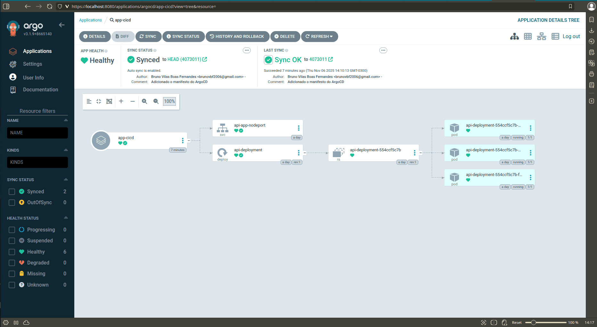
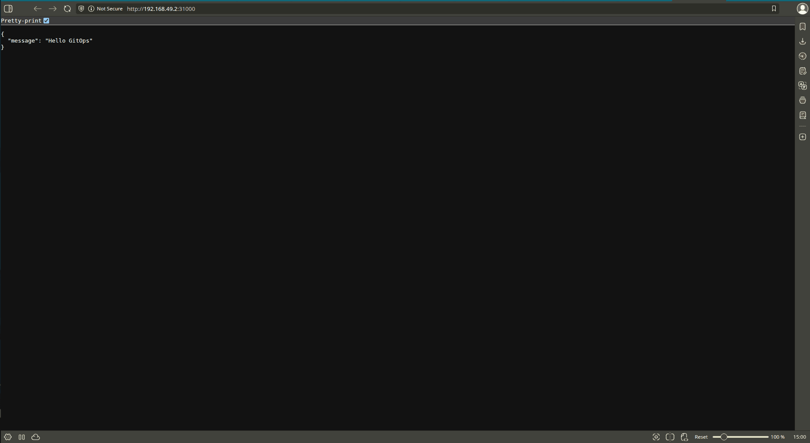

# CI/CD com o Github Actions (Em progresso)
Este é um projeto que busca implementar todas as etapas do ciclo de desenvolvimento de software, partindo do ambiente local para repositorios de código remoto com automação em processos de build, e então atualização automatica de manifestos de infraestrutura (Kubernetes) com praticas de GitOps integradas para o deploy automatizado.

O objetivo desse texto é documentar todo o passo a passo realizado durante o processo.

ATENÇÃO! Os comandos utilizados e documentados aqui são para a shell `bash` que é utilizada nos sistemas Linux/MacOS.

## ⚠️ Requisitos
- Minikube (v1.37.0)
- ArgoCD (v3.1.9)
- Git (2.43.0+)
- Docker Engine (28.5.1)
- Kubectl (v1.34.1)
- Kustomize (v5.3.0)
- Python (3.12.3)
- Pip (24.0)
- Conta no GitHub
- Conta no DockerHub

## 1️⃣ – Criar a aplicação FastAPI
Nessa etapa do projeto o objetivo é criar nossos repositórios que serão utilizados futuramente, introduzir a aplicação de modelo que será utilizada e criar o Dockerfile para permitir o `build` da imagem da aplicação.

A aplicação modelo é uma API escrita Python utilizando a biblioteca/framework FastAPI, esse por sua vez é uma biblioteca do Python para criação de APIs de forma simples e rápida.

- ### Criação dos repositórios do projeto
    Antes da própria aplicação vamos criar os repositorios locais e remotos que serão utilizados no projeto.

    Crie no github dois repositórios, um com a finalidade de ser o repositório do código fonte da nossa aplicação e o outro para práticas de GitOps.

    Caso precise de ajuda na criação, acesse a [documentação do GitHub](https://docs.github.com/pt/repositories/creating-and-managing-repositories/quickstart-for-repositories) sobre esse assunto.

    Após isso crie também os repositórios localmente, isso é crie duas pastas no seu sistema operacional, e dentro de cada uma utilize o comando `git init`.

    Faça a conexão dos repositórios remotos e locais seguindo as instruções fornecidas pelo GitHub ao criar os repositórios.

- ### Criação da aplicação Python
    Acesse via linha de comando a pasta para o código fonte que foi criada nos passos anteriores.

    Dentro da pasta vamos criar um `venv` do Python. Isso é uma ferramente que permite utilizar um "ambiente virtual" de desenvolvimento para gerenciar as dependências do projeto sem que precisem ser instaladas diretamente na nossa máquina inteira, ficam contidas no projeto especifico, dessa forma ao desenvolver multiplos projetos grandes com diversas dependências, a possibilidade de conflitos de versão é evitada.

    Essa é uma boa prática de desenvolvimento no ambiente Python. Para criar um `venv` utilize o seguinte comando:

    ``` bash
    python3 -m venv .venv
    ```

    Com o `venv` criado, para começar a utiliza-lo execute também:

    ``` bash
    source .venv/bin/activate
    ```
    
    Agora sim podemos instalar o FastAPI utilizando o gerenciador de pacotes `pip`, dentro do ambiente virtual esse pacote de dependência do projeto vai ficar contido sem gerar conflitos. Execute o seguinte comando para realizar a instalação:

    (baixe junto o pacote `uvicorn` que vai permitir a gente testar a nossa aplicação)

    ``` bash
    pip install fastapi uvicorn
    ```

    **Lembrando de utilizar o interpretador Python que está dentro da pasta `.venv`, não o comum do sistema.**

    Crie o arquivo contendo o código fonte da aplicação:

    ``` python
    from fastapi import FastAPI 

    app = FastAPI() 

    @app.get("/")
    async def root(): 
        return {"message": "Hello World"}
    ```

- ### Criação do Dockerfile e building
    A criação dos arquivos necessarios para fazer o build da imagem do Docker são fundamentais para o funcionamento da pipeline, pois nosso aplicação vai ser executada por meio de um cluster Kubernetes e precisamos prover as imagens que ele usará.


    Crie um arquivo `.dockerignore` com o seguinte conteúdo para ignorar arquivos desnecessarios de entrarem no processo de build.
    ``` .dockerignore
    .venv/
    __pycache__/
    .git
    .gitignore
    .vscode/
    ```

    Agora o arquivo `Dockerfile` com as instruções de como o Docker deve fazer o build, usaremos a imagem base do python 3.12, fazemos o `COPY` do requirements.txt para conseguir instalar as dependências por meio de um comando `pip`. Copiamos o conteúdo do nosso repositório para a imagem, definimos a porta de escuta do container como 8000 e por ultimo o comando `uvicorn` para servir a aplicação.
    ``` Dockerfile
    FROM python:3.12-slim
    WORKDIR /app
    COPY requirements.txt .
    RUN pip install --no-cache-dir -r requirements.txt
    COPY . .
    EXPOSE 8000
    CMD ["uvicorn", "main:app", "--host", "0.0.0.0", "--port", "8000"]
    ```

    Para testar se a nossa imagem está funcional, vamos fazer o build dela e executar como container. Utilize o seguinte comando para o build:
    ``` bash
    docker build -t fastapi .
    ```

    Depois de terminar o build da imagem, com esse outro comando podemos executar um container e testar se a aplicação está funcional e acessivel. Use o comando e tente acessar `localhost` no seu navegador.
    ``` bash
    docker run -d -p 80:8000 --name api fastapi
    ```

## 2️⃣ – Criar o GitHub Actions (CI/CD)
O GitHub actions vai ser a ferramenta de CI que utilizaremos, sendo uma parte essencial do processo de automatização no ciclo de vida do software. 

- ### Criar diretório de workflows
    Para usar o GitHub actions precisamos criar no repositório um diretório `.github` e dentro dele um outro diretório `workflows`, este contendo um arquivo yaml que vai definir as operações de CI.

    ``` bash
    mkdir -p .github/workflows/ && cd .github/workflows/
    touch ci-build-push.yml
    ```
- ### Criar a chave de acesso ao repositório GitOps
    Usaremos uma chave SSH para garantir o acesso ao repositório que terá os manifestos da aplicação. Vá para um diretório onde deseja guardar sua chave (exemplo recomendado: `~/.ssh`), lembre-se de que a chave não deve ser compartilhada.

    Para criar a chave SSH, utilize o seguinte comando:

    ``` bash
    ssh-keygen -t rsa -b 4096 -f ./cicd-ssh-key -N "" -C "cicd-ssh-key"
    ```

    Antes de prosseguir para o proximo passo precisamos cadastrar a chave pública no repositório GitOps. (**Lembre-se de permitir a escrita no repositório, pois isso é necessario para o workflow**)

    Para saber mais sobre, acesse a [documentação oficial do GitHub sobre chaves de implantação](https://docs.github.com/pt/authentication/connecting-to-github-with-ssh/managing-deploy-keys).

- ### Gerar token de acesso pessoal do DockerHub
    Seguindo a mesma lógica de chave de acesso porém dessa vez para o DockerHub, esse token vai garantir que podemos fazer uma operação de `push` para o registry.

    **Ao criar o token de acesso lembre-se de garantir o direito de escrita e leitura. Lembre-se também de guardar o valor do token pois ele só exibido 1 vez.**

    Em caso de dúvida no processo de criação acesse a [documentaçao oficial do Docker sobre tokens de acesso](https://docs.docker.com/security/access-tokens/).

- ### Criar segredos no GitHub
    Precisamos também dos segredos no repositório do código fonte, com eles podemos armazenar os dados sensíveis de autentificação de forma segura e utiliza-los no arquivo de workflow do GitHub Actions.

    Para criar um segredo vá até as configurações do repositório com o código fonte da aplicação, clique em `secrets and variables`, em seguida em `actions`, então em secrets clique em `New repository secret`.

    Os segredos que devem ser criados são:
    - *DOCKER_USERNAME* -> com o nome de usuario do DockerHub
    - *DOCKER_PASSWORD* -> com o token de acesso que geramos no DockerHub
    - *SSH_PRIVATE_KEY* -> com a chave SSH **privada** do par que geramos.

    Utilize os mesmos nome de segredos para ser compativel com a variavel no arquivo workflow que vai ser criado.

- ### Criar o arquivo workflow
    Finalmente podemos criar o arquivo yaml do workflow para o GitHub actions. 
    
    Como ainda não temos o manifesto do Kubernetes, a parte de alteração do manifesto, commit e push não vai estar completa por agora, completaremos essa sessão nos proximos passos.

    ``` yaml
    name: CI Build Push
    on: 
        push:
            branches:
                - main
    jobs:
        build-and-push:
            runs-on: ubuntu-latest
            steps:
                - name: Repo checkout
                uses: actions/checkout@v5

                - name: Login Docker hub
                uses: docker/login-action@v3
                with:
                    username: ${{ secrets.DOCKER_USERNAME }}
                    password: ${{ secrets.DOCKER_PASSWORD }}

                - name: Set up QEMU
                uses: docker/setup-qemu-action@v3

                - name: Set up Docker Buildx
                uses: docker/setup-buildx-action@v3

                - name: Build and push
                uses: docker/build-push-action@v6
                with:
                    context: .
                    push: true
                    tags: |
                        ${{ secrets.DOCKER_USERNAME }}/cicd-app-pb:latest
                        ${{ secrets.DOCKER_USERNAME }}/cicd-app-pb:${{ github.sha }}

        # esse job vai ser criado após o manifesto Kubernetes
        update-gitops-manifest:
            runs-on: ubuntu-latest
            needs: build-and-push
            steps:
                - name: Deploy placeholder
                run: echo "Deploying application.."
    ```
     

## 3️⃣ – Repositório Git com os manifests do ArgoCD
Nessa etapa o objetivo é criar o arquivo manifesto para o Kubernetes, enviar esse arquivo para o repositório remoto e ajustar o arquivo de workflow do GitHub Actions para atualizar o manifesto automaticamente, utilizando a imagem nova construida.

- ### Criar manifesto Kubernetes
    No diretório com o repositório git para manifestos que criamos anteriormente, crie uma pasta chamada `k8s` para indicar manifestos Kubernetes.

    Dentro dessa pasta recém criada, crie um arquivo com um nome como `api-manifest.yml` .

    Após isso preencha o conteúdo do arquivo de manifesto: (SUBSTITUIR OS VALORES ENTRE CHAVES {} PARA CORRESPONDER COM SEU PROJETO)

    ``` yaml
    ---
    apiVersion: apps/v1
    kind: Deployment
    metadata:
    name: api-deployment
    spec:
    replicas: 3
    selector:
        matchLabels:
        app: cicd-app-pb
    template:
        metadata:
        labels:
            app: cicd-app-pb
        spec:
        containers:
        - name: cicd-app-pb
            image: {SEU_NOME_DOCKERHUB}/{SEU_REPOSITORIO_DOCKERHUB}:placeholder
            ports:
            - containerPort: 8000

    ---
    ---
    apiVersion: v1
    kind: Service
    metadata:
    name: api-app-nodeport
    spec:
    type: NodePort
    selector:
        app: cicd-app-pb
    ports:
        - port: 80
        targetPort: 8000
        nodePort: 31000
        protocol: TCP
        
    ---
    ```

- ### Criar arquivo Kustomize
    Kustomize permite criar arquivos de customização com variaveis e outros elementos em um manifesto Kubernetes, isso será especialmente útil para nós quando modificarmos o workflow para alterar o comportamento do manifesto.

    Crie também na pasta `k8s`, um arquivo com o nome de `kustomization.yml` com o conteúdo:

    ``` yaml
    apiVersion: kustomize.config.k8s.io/v1beta1
    kind: Kustomization

    resources:
    - api-manifest.yml

    images:
    - name: {SEU_NOME_DOCKERHUB}/{SEU_REPOSITORIO_DOCKERHUB}
    newTag: placeholder
    ```

- ### Testando o manifesto criado
    Para testar se o deployment está funcional, vamos pedir para o Kubernetes localmente tentar aplicar o que está declarado no documento.

    Primeiro inicie o Minikube:

    ``` bash
    minikube start
    ```

    Aplique o manifesto. Para isso, a partir da raiz do diretório do repositório git, execute o seguinte comando: (o `-k` garante que o kubectl utilizará o Kustomize)

    ``` bash
    kubectl apply -k k8s/
    ```

    Espere um tempo para iniciar os containers e teste se nossa aplicação está acessivel por meio do service `NodePort` declarado no manifesto, um comando simples do Minikube que abre automaticamente o IP e porta do cluster no navegador é:
    ``` bash
    minikube service api-app-nodeport
    ```

    Se foi possivel visualizar a resposta da API que definimos no arquivo Python, significa que deu tudo certo.

- ### Atualizando o arquivo workflow
    O workflow de antes não estava completo pois ainda não tinhamos o repositório de GitOps populado. Agora temos todos os recursos e devemos finalizar de escrever o workflow GitHub Actions.

    Modifique o Job `update-gitops-manifest` para que ele tenha o seguinte conteúdo:

    ``` yaml
    update-gitops-manifest:
        runs-on: ubuntu-latest
        needs: build-and-push
        steps:
            - name: Configure SSH
            uses: webfactory/ssh-agent@v0.9.0
            with:
                ssh-private-key: ${{ secrets.SSH_PRIVATE_KEY }}

            - name: Add GitHub to known_hosts
            run: ssh-keyscan github.com >> ~/.ssh/known_hosts

            - name: Clone GitOps repository
            run: git clone git@github.com:{SEU_USUARIO_GITHUB}/{NOME_REPOSITORIO_GITOPS}.git gitops-repo

            - name: Configure Git
            working-directory: ./gitops-repo
            run: |
                git config --global user.name 'GitHub Actions'
                git config --global user.email 'actions@github.com'

            - name: Install Kustomize
            run: |
                curl -s "https://raw.githubusercontent.com/kubernetes-sigs/kustomize/master/hack/install_kustomize.sh"  | bash
                sudo mv kustomize /usr/local/bin/

            - name: Update image tag in manifest
            working-directory: ./gitops-repo/k8s
            run: kustomize edit set image ${{ secrets.DOCKER_USERNAME }}/cicd-app-pb:${{ github.sha }}
            
            - name: Commit and push changes
            working-directory: ./gitops-repo
            run: |
                git add k8s/kustomization.yml
                
                if ! git diff --staged --quiet; then
                git commit -m "Atualizado a tag da imagem da aplicação para ${{ github.sha }}"
                git push
                else
                echo "Sem mudanças no código. A tag da imagem já está atualizada."
                fi
    ```

    Caso deseja visualizar o resultado final do arquivo de workflow, clique em [meu workflow](.github/workflows/ci-build-push.yml).

    Para testar melhor o resultado do workflow, antes de fazer o push, modifique algo no código fonte, como trocar a resposta da API para outra.

## 4️⃣ – Criar App no ArgoCD
Nesta etapa, vamos configurar o ArgoCD para monitorar nosso repositório de manifestos.

**Pré-requisito**: Assumimos que o ArgoCD já está instalado no cluster.

- ### Abrindo a porta para o ArgoCD
    Abriremos uma porta de escuta para o serviço do ArgoCD, dessa forma conseguiremos nos comunicar com ele.

    Para isso execute: (**ATENÇÃO!** Este comando vai "prender" o seu terminal para exibir os logs de conexão. Recomendo abrir um novo terminal dedicado apenas para ele e deixá-lo rodando.)

    ``` bash
    kubectl port-forward svc/argocd-server -n argocd 8080:443
    ```

- ### Fazendo login no ArgoCD
    Agora para se autenticar e ser capaz de utiliza-lo, faremos login no ArgoCD.

    O nome de usuario padrão é: `admin`
    
    A senha deve ser obtida através da saída do comando:

    ``` bash
    kubectl get secret argocd-initial-admin-secret -n argocd -o jsonpath="{.data.password}" | base64 -d
    ```

    Com essas duas informações necessárias obtidas, para fazer o login propriamente dito via interface de linha de comando, execute:

    ``` bash
    argocd login localhost:8080
    ```

    Recomendo logar via navegador também, para isso é só digitar `localhost:8080` na barra de endereço e inserir os dados que já obtemos.

- ### Gerando chave de acesso SSH
    Precisamos criar outra chave SSH para o repositório GitOps, dessa vez a chave tem um propósito diferente da outra, a anterior era para que o workflow da pipeline tivesse a capacidade de fazer `push` para o repositório GitOps. Dessa vez precisamos de uma chave para conceder permissão do ArgoCD visualizar o conteúdo do repositório.

    Por conta disso, a permissão da chave nova chave será de **somente leitura**.

    Para criar a chave e adiciona-la ao GitHub siga o mesmo procedimento que já realizamos na parte/etapa 2 desse documento. As únicas alterações serão o nome da chave (para remeter ao ArgoCD) e a permissão no repositório de somente leitura.

    Após isso, temos um passo extra para fazer com que o ArgoCD consiga utilizar essa chave para se comunicar com o repositório remoto. Isso pode ser feito através do comando: (SUBSTITUA OS VALORES ENTRE CHAVES {} PARA CORRESPONDER AO SEUS)

    ``` bash
    argocd repo add {URL_SSH_DO_SEU_REPO} --ssh-private-key-path {CAMINHO_DA_CHAVE_PRIVADA}
    ```

- ### Criando manifesto ArgoCD
    Um manifesto ArgoCD vai ser responsavel por declarar exatamente a estrutura do ArgoCD que vai comandar nosso cluster Kubernetes. Dessa forma não precisamos configurar manualmente, e seguimos a risca as boas práticas de GitOps (toda a fonte de verdade está no repositório de manifestos).

    Primeiro crie um novo diretório na raiz da pasta onde está o repositório git com os manifestos, nomeie esse novo diretório como `apps`.

    Dentro de `apps` crie um novo arquivo com um nome como `app-cicd.yml`, ele vai ser nosso manifesto para o ArgoCD.

    Preencha o conteúdo do arquivo:

    ``` yaml
    apiVersion: argoproj.io/v1alpha1
    kind: Application
    metadata:
        name: app-cicd
        namespace: argocd
    spec:
        project: default
        source:
            repoURL: 'git@github.com:{SEU_USUARIO_GITHUB}/{SEU_REPOSITORIO_GITOPS}.git'
            targetRevision: HEAD
            path: k8s/
        destination:
            server: 'https://kubernetes.default.svc'
            namespace: default
        syncPolicy:
            automated:
                prune: true
                selfHeal: true
            syncOptions:
                - CreateNamespace=true
    ```

    Esse yaml declara que queremos o ArgoCD observando nosso repositório na pasta `k8s`, na branch principal, com autosync habilitado (faz o rollout no cluster automaticamente ao detectar uma mudança no repositório remoto), ele também está configurado para reverter alguma mudança manual feita no cluster, dessa forma refletindo exatamente o repositório git não a configuração local.

- ### Commit e fazendo o Bootstrap da aplicação
    Esses são os passos finais para implementar o ArgoCD, precisamos atualizar o repositório GitOps remoto no GitHub e executar um comando localmente para que o ArgoCD inicie a execução.

    Para atualizar o repositório remoto, dentro do seu diretório do GitOps utilize os comandos:

    ``` bash
    git add apps/app-cicd.yml
    git commit -m "Adicionado o manifesto do ArgoCD"
    git push
    ```

    Inicie a execução do ArgoCD através da utilização do seguinte comando na raiz do diretório onde está o repositório GitOps:

    ``` bash
    kubectl apply -f apps/app-cicd.yml
    ```

- ### Visualizando o cluster no ArgoCD
    Podemos visualizar de forma intuitiva o funcionamento do cluster por meio da interface gráfica web do ArgoCD.

    Conseguimos acessar a interface através do endereço `localhost:8080` no navegador, conforme a porta que foi exposta nos passos anteriores e para se autentificar são as mesmas credenciais também dos passos anteriores.

    

## 5️⃣ – Acessar e testar a aplicação localmente
Para validar que todos os passos anteriores foram realizados corretamente, a nossa aplicação deve estar agora acessivel, e o ciclo CI-CD deve ser realizado de forma completa.

- ### Testando acessibilidade da API
    Primeiramente vamos testar se a API está acessivel via o serviço de `NodePort` dessa vez rodando pelo ArgoCD.

    Utilize o mesmo comando do ultimo teste que fizemos para acessar a API:

    ``` bash
    minikube service api-app-nodeport
    ```

    Se deu tudo certo, automaticamente será aberto no seu navegador padrão a resposta da API no endereço padrão.

    

- ### Testando a atualização automatica do cluster
    Vamos mudar a mensagem padrão da API e verificar se o procedimento de build da imagem, atualização do repositório GitOps e sincronia do ArgoCD está corretamente implementado.

    Modifique a mensagem da API como por exemplo de `hello GitOps` para `hello ArgoCD`, após isso execute os comandos para enviar as modificações no código fonte para o repositório remoto. (de dentro da raiz do diretório do código)

    ``` bash
    git add main.py
    git commit -m "Atualização da mensagem da API"
    git push
    ```

    Aguarde um momento até que o ArgoCD sincronize com o repositório remoto (leva cerca de 3 minutos), após esse tempo recarregue a página da aplicação e verifique se a nova mensagem apareceu.

## 🔚 Conclusão
