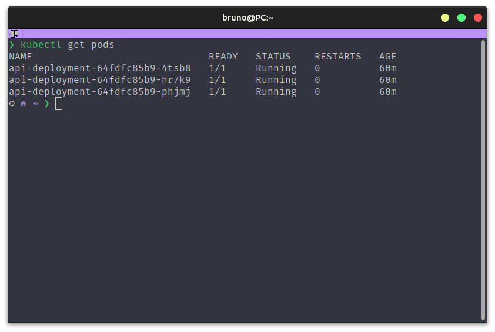
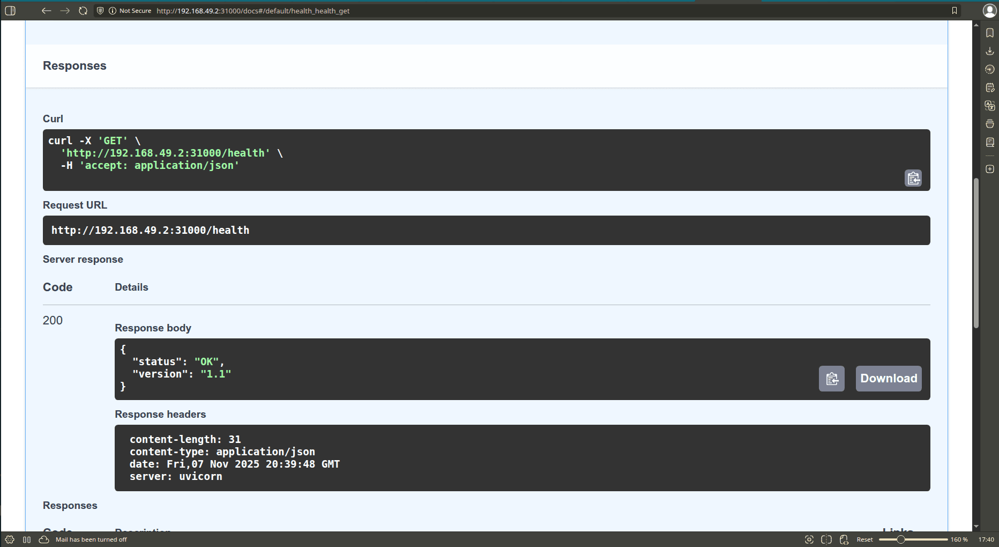

# 🚀 Entregáveis do Projeto CI/CD

Abaixo estão todos os entregáveis solicitados para a avaliação deste projeto.

### 1. Links dos Repositórios
* **Repositório da Aplicação:** `https://github.com/devbrunofernandes/cicd-actions-pb`
* **Repositório de Manifestos (GitOps):** `https://github.com/devbrunofernandes/cicd-manifests-pb`

### 2. Evidência de Build e Push (Docker Hub)
O pipeline de CI está configurado para fazer o build e push de cada commit na branch `main`.

* **Evidência 1:** O [arquivo de workflow](https://github.com/devbrunofernandes/cicd-actions-pb/blob/main/.github/workflows/ci-build-push.yml) define o job `Build and push`.
* **Evidência 2:** O *badge* de status do build (acima) mostra o sucesso.
* **Evidência 3:** [Link para o Docker Hub](https://hub.docker.com/r/devbrunofernandes/cicd-app-pb) mostrando as imagens tagueadas por SHA.

### 3. Evidência de Atualização Automática (GitOps)
O job `update-gitops-manifest` atualiza automaticamente o `kustomization.yml` no repositório de manifestos.

* **Evidência:** [Histórico de Commits do Repositório GitOps](https://github.com/devbrunofernandes/cicd-manifests-pb/commits/main/). Note que os commits de atualização de imagem são feitos pelo usuário "GitHub Actions".

### 4. Evidência de Implantação e Resposta
As capturas de tela abaixo comprovam que o ArgoCD detectou a mudança e a aplicação está no ar.

**Evidência 4.1: ArgoCD Sincronizado**
*O ArgoCD mostra o app `app-cicd` saudável e sincronizado com o commit mais recente.*

**Evidência 4.2: Pods em Execução (Print do `kubectl`)**
*Mostra em execução as 3 replicas de pods declaradas pelo deployment no manifesto.*

**Evidência 4.3: Resposta da Aplicação (Antes da Atualização)**
*A aplicação responde com a mensagem original.*

**Evidência 4.4: Resposta da Aplicação (Após Atualização Automática)**
*Após um `git push` no código-fonte, o pipeline completo rodou e o ArgoCD atualizou o cluster sem intervenção manual, como visto pela nova mensagem.*
